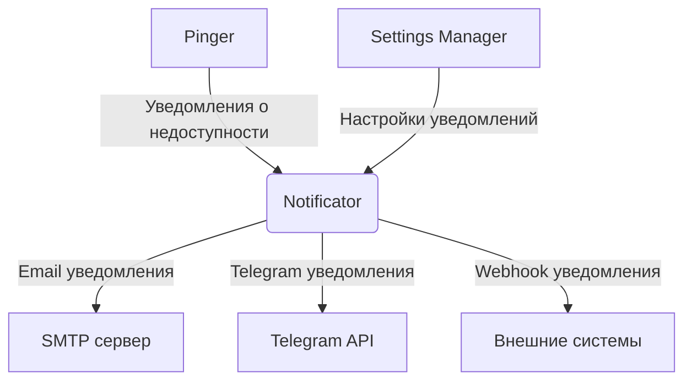

# Архитектура модуля Notificator системы мониторинга PingTower

## 1. Введение

Модуль Notificator является ключевым компонентом системы мониторинга PingTower, отвечающим за доставку уведомлений о недоступности ресурсов и других событиях системы. Модуль получает уведомления от других компонентов системы (в частности, от модуля Pinger) через Apache Kafka и доставляет их пользователям через различные каналы связи.

## 2. Общая архитектура

### 2.1. Технологический стек

- **Язык программирования**: Java
- **Фреймворк**: Spring Boot
- **Система обмена сообщениями**: Apache Kafka
- **Система сборки**: Gradle

### 2. Схема взаимодействия модулей



## 3. Основные компоненты модуля

### 3.1. Kafka Consumer

Отвечает за получение сообщений из Kafka топика `pingtower.check.alerts`. Десериализует сообщения в объекты уведомлений и передает их Notification Service.

### 3.2. Notification Service

Основной сервис обработки уведомлений. Получает уведомления от Kafka Consumer, выполняет группировку уведомлений через Notification Grouping Service, применяет правила эскалации через Escalation Service и передает уведомления соответствующим каналам через Notification Channel Services.

### 3.3. Notification Channel Services

Сервисы для различных каналов доставки:

- EmailNotificationService - для отправки email уведомлений
- TelegramNotificationService - для отправки уведомлений через Telegram
- WebhookNotificationService - для отправки уведомлений через webhooks
- Другие каналы по необходимости

### 3.4. Escalation Service

Управляет правилами эскалации. Определяет, когда и каким образом эскалировать уведомления. Работает с Configuration Service для получения настроек.

### 3.5. Notification Grouping Service

Группирует уведомления для предотвращения спама. Объединяет уведомления по различным критериям (ресурс, тип ошибки и т.д.). Работает с Configuration Service для получения настроек.

### 3.6. Configuration Service

Управляет настройками уведомлений. Получает настройки из внешних источников (Settings Manager через Kafka или локальные конфигурации). Предоставляет настройки другим сервисам.

### 3.7. Security Service

Обеспечивает безопасность при работе с различными каналами. Управляет учетными данными для каналов (токены, ключи API и т.д.). Шифрует чувствительные данные.

## 4. Механизмы обработки уведомлений

### 4.1. Получение уведомлений

1. Kafka Consumer получает сообщение из топика `pingtower.check.alerts`
2. Сообщение десериализуется в объект AlertMessage
3. AlertMessage передается Notification Service

### 4.2. Группировка уведомлений

1. Notification Service передает уведомление Notification Grouping Service
2. Grouping Service проверяет, есть ли существующая группа для этого уведомления
3. Если группа существует, уведомление добавляется в нее
4. Если группа не существует, создается новая группа
5. По истечении времени группировки группа отправляется на обработку

### 4.3. Применение правил эскалации

1. Для каждого уведомления Escalation Service проверяет текущее состояние эскалации
2. Если условия эскалации выполнены, применяется следующий уровень эскалации
3. Уведомление отправляется соответствующим получателям через выбранные каналы

### 4.4. Отправка уведомлений

1. Notification Service определяет каналы доставки для уведомления
2. Для каждого канала вызывается соответствующий Notification Channel Service
3. Channel Service форматирует уведомление и отправляет его через соответствующий механизм

## 5. Поддерживаемые каналы уведомлений

### 5.1. Email

Использует spring-boot-starter-mail для отправки email-уведомлений. Поддерживает:

- Настройку SMTP сервера, порта, протокола (SSL/TLS)
- Аутентификацию с учетными данными
- Шаблоны сообщений
- Адреса отправителя и получателя

### 5.2. Telegram

Интеграция с Telegram Bot API для отправки уведомлений. Поддерживает:

- Отправку сообщений в чаты и отдельным пользователям
- Использование токена бота для аутентификации
- Шаблоны сообщений

### 5.3. Webhooks

Отправка HTTP запросов на указанные URL. Поддерживает:

- Настройку URL endpoints
- Различные форматы данных (JSON, XML)
- Таймауты
- Аутентификацию (токены, ключи API)

### 5.4. Расширяемость

Архитектура модуля позволяет легко добавлять новые каналы уведомлений через реализацию интерфейса NotificationChannel.

## 6. Механизм правил эскалации

### 6.1. Условия эскалации

- Время бездействия (если проблема не решена в течение определенного времени)
- Количество повторных уведомлений
- Тип ошибки или критичность проблемы
- Другие пользовательские условия

### 6.2. Последовательность эскалации

- Определение получателей на каждом уровне эскалации
- Выбор каналов доставки для каждого уровня
- Временные интервалы между уровнями эскалации

### 6.3. Управление состоянием эскалации

- Отслеживание текущего уровня эскалации для каждого уведомления
- Хранение истории эскалации
- Возможность ручного управления процессом эскалации

## 7. Механизм группировки уведомлений

### 7.1. Критерии группировки

- По ресурсу (URL или идентификатор проверки)
- По типу ошибки (таймаут, ошибка SSL, HTTP код ошибки и т.д.)
- По временному интервалу (группировка уведомлений за определенный период)
- По получателю (группировка уведомлений для одного и того же получателя)

### 7.2. Алгоритмы агрегации

- Буферизация уведомлений в течение заданного времени
- Объединение похожих уведомлений в одно сообщение
- Подсчет количества повторяющихся уведомлений

### 7.3. Формат группированных уведомлений

- Сводная информация о группе уведомлений
- Список ресурсов с проблемами
- Статистика по типам ошибок
- Временные рамки группы уведомлений

## 8. Формат данных для получения уведомлений через Kafka

Модуль получает уведомления из топика `pingtower.check.alerts` в следующем формате:

```json
{
  "checkId": "string",
  "resourceUrl": "string",
  "timestamp": "ISO8601 datetime",
  "status": "DOWN",
  "downtimeDuration": "number (ms)",
  "errorMessage": "string",
  "previousStatus": "UP|UNKNOWN"
}
```

Java класс для десериализации:

```java
public class AlertMessage {
    private String checkId;
    private String resourceUrl;
    private LocalDateTime timestamp;
    private String status;
    private long downtimeDuration;
    private String errorMessage;
    private String previousStatus;
    
    // Геттеры и сеттеры
}
```

## 9. Настройка параметров уведомлений

### 9.1. Параметры каналов доставки

- Email: SMTP сервер, порт, протокол, учетные данные, адрес отправителя, шаблоны сообщений
- Telegram: токен бота, ID чата или пользователя по умолчанию, шаблоны сообщений
- Webhooks: URL по умолчанию, формат данных, таймауты, аутентификация

### 9.2. Правила группировки уведомлений

- Интервалы группировки
- Максимальное количество уведомлений в группе
- Критерии группировки
- Исключения из группировки

### 9.3. Правила эскалации

- Условия эскалации
- Последовательность эскалации
- Временные интервалы между уровнями

### 9.4. Общие параметры

- Форматы даты и времени
- Локализация сообщений
- Шаблоны уведомлений
- Уровни логирования

### 9.5. Механизмы хранения и обновления

- Локальные конфигурационные файлы
- Внешние конфигурационные сервисы
- Динамическое обновление без перезапуска
- Валидация конфигураций

## 10. Аспекты безопасности

### 10.1. Защита учетных данных

- Шифрование токенов, паролей и других секретов
- Использование внешних систем хранения секретов
- Минимизация хранения секретов в конфигурационных файлах

### 10.2. Аутентификация и авторизация

- Аутентификация при подключении к каналам
- Авторизация для отправки уведомлений определенным получателям
- Управление правами доступа к настройкам уведомлений

### 10.3. Шифрование данных

- Шифрование уведомлений при передаче (TLS/HTTPS)
- Шифрование конфиденциальной информации в содержимом уведомлений

### 10.4. Аудит и логирование

- Логирование попыток отправки уведомлений
- Аудит изменений конфигураций
- Мониторинг несанкционированного доступа

### 10.5. Защита от атак

- Ограничение частоты отправки уведомлений
- Валидация содержимого уведомлений
- Защита от инъекций в шаблонах сообщений

## 11. Заключение

Модуль Notificator спроектирован как масштабируемый и расширяемый компонент системы мониторинга PingTower. Его архитектура позволяет легко добавлять новые каналы уведомлений, настраивать правила эскалации и группировки, а также обеспечивает высокий уровень безопасности при работе с различными каналами связи. Благодаря использованию Spring Boot и Apache Kafka, модуль обеспечивает высокую производительность и надежность при доставке уведомлений пользователям.
