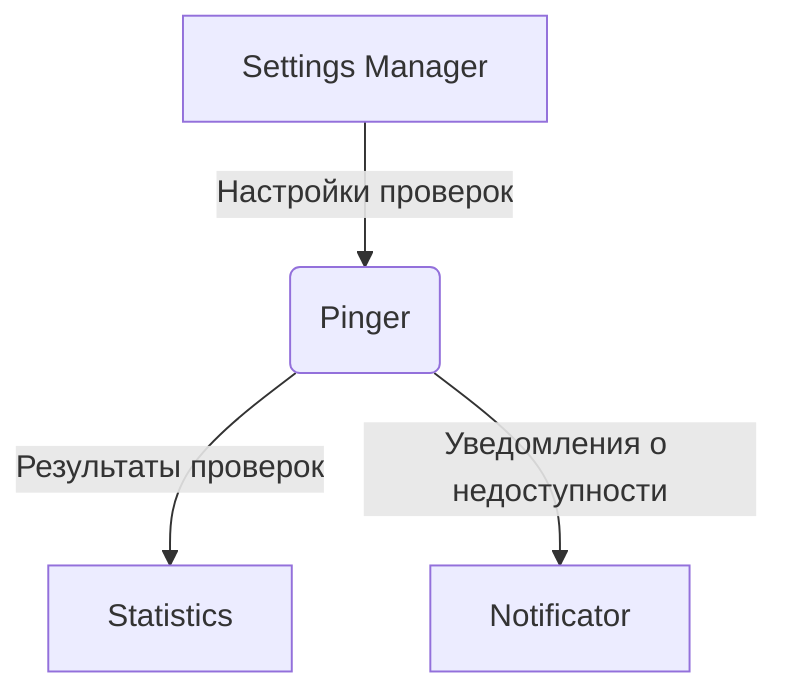

# Архитектура модуля Pinger системы мониторинга PingTower

## 1. Введение

Модуль Pinger является ключевым компонентом системы мониторинга PingTower, отвечающим за проверку доступности различных ресурсов. Он выполняет HTTP/HTTPS запросы к контролируемым ресурсам, анализирует коды ответов, измеряет время отклика, проверяет доступность контента и SSL-сертификаты, а также поддерживает более сложные сценарии тестирования.

## 2. Общая архитектура

### 2.1. Технологический стек

- **Язык программирования**: Java
- **Фреймворк**: Spring Boot
- **Система обмена сообщениями**: Apache Kafka
- **Система сборки**: Gradle

### 2.2. Схема взаимодействия модулей



## 3. Основные компоненты модуля Pinger

### 3.1. Scheduler Service

Отвечает за планирование и запуск проверок в соответствии с заданной частотой. Использует Spring Scheduler для управления периодическими задачами.

### 3.2. Check Executor Service

Выполняет непосредственно проверки доступности ресурсов. Поддерживает различные типы проверок:

- HTTP/HTTPS запросы
- TCP соединения
- DNS проверки
- Более сложные сценарии API тестирования

### 3.3. HTTP Client Service

Специализированный компонент для выполнения HTTP/HTTPS запросов. Обеспечивает:

- Настройку таймаутов
- Обработку SSL-сертификатов
- Измерение времени отклика
- Анализ кодов ответов
- Проверку контента ответа

### 3.4. Result Processor Service

Обрабатывает результаты проверок, форматирует их и отправляет в Kafka. Также отвечает за:

- Агрегацию метрик
- Определение состояния доступности ресурса
- Формирование уведомлений при недоступности

### 3.5. Kafka Producer Service

Отправляет результаты проверок в Kafka топики для дальнейшей обработки другими модулями системы.

## 4. Механизм выполнения проверок

### 4.1. Планирование проверок

1. Scheduler Service получает настройки проверок из Settings Manager через Kafka.
2. На основе этих настроек создаются задачи с определенной периодичностью.
3. При наступлении времени выполнения задача передается Check Executor Service.

### 4.2. Выполнение HTTP/HTTPS проверок

1. Check Executor Service вызывает HTTP Client Service с параметрами проверки.
2. HTTP Client Service выполняет запрос с учетом:
   - URL ресурса
   - Метода HTTP запроса
   - Таймаутов соединения и чтения
   - Ожидаемых заголовков и тела ответа
   - Параметров SSL (при необходимости)
3. Измеряются метрики:
   - Время соединения
   - Время получения первого байта
   - Общее время выполнения запроса
4. Анализируется ответ:
   - Код состояния HTTP
   - Заголовки ответа
   - Тело ответа (при необходимости)
   - Валидация SSL-сертификата

### 4.3. Выполнение других типов проверок

Модуль поддерживает расширяемую архитектуру для добавления новых типов проверок:

- TCP проверки
- DNS проверки
- Проверки API с валидацией JSON/XML ответов

## 5. Формат данных для передачи результатов через Kafka

### 5.1. Топики Kafka

- `pingtower.check.results` - основной топик для результатов проверок
- `pingtower.check.alerts` - топик для уведомлений о недоступности ресурсов

### 5.2. Формат сообщений

#### Результат проверки (check.results)

```json
{
  "checkId": "string",
  "resourceUrl": "string",
  "timestamp": "ISO8601 datetime",
  "status": "UP|DOWN|UNKNOWN",
  "responseTime": "number (ms)",
  "httpStatusCode": "number (optional)",
  "errorMessage": "string (optional)",
  "metrics": {
    "connectionTime": "number (ms)",
    "timeToFirstByte": "number (ms)",
    "sslValid": "boolean (optional)",
    "sslExpirationDate": "ISO8601 datetime (optional)"
  }
}
```

#### Уведомление о недоступности (check.alerts)

```json
{
  "checkId": "string",
  "resourceUrl": "string",
  "timestamp": "ISO8601 datetime",
  "status": "DOWN",
  "downtimeDuration": "number (ms)",
  "errorMessage": "string",
  "previousStatus": "UP|UNKNOWN"
}
```

## 6. Расширяемость для различных типов проверок

Архитектура модуля Pinger построена с учетом возможности расширения для поддержки различных типов проверок:

### 6.1. Интерфейс CheckExecutor

```java
public interface CheckExecutor {
    CheckResult execute(CheckConfiguration config);
    boolean supports(CheckType type);
}
```

### 6.2. Реализации CheckExecutor

- `HttpCheckExecutor` - для HTTP/HTTPS проверок
- `TcpCheckExecutor` - для TCP проверок
- `DnsCheckExecutor` - для DNS проверок
- `ApiCheckExecutor` - для сложных API сценариев

### 6.3. Фабрика CheckExecutor

Позволяет динамически выбирать нужный executor на основе типа проверки.

## 7. Настройка параметров проверок

### 7.1. Конфигурация через application.properties

```properties
# Параметры планировщика
pinger.scheduler.fixed-rate=60000
pinger.scheduler.initial-delay=5000

# Параметры HTTP клиента
pinger.http.connect-timeout=5000
pinger.http.read-timeout=10000
pinger.http.connection-request-timeout=2000

# Параметры Kafka
spring.kafka.bootstrap-servers=localhost:9092
spring.kafka.producer.key-serializer=org.apache.kafka.common.serialization.StringSerializer
spring.kafka.producer.value-serializer=org.springframework.kafka.support.serializer.JsonSerializer
```

### 7.2. Динамическая конфигурация через Settings Manager

Проверки могут быть настроены динамически через Settings Manager, который отправляет конфигурации в Pinger через Kafka.

Пример конфигурации проверки:

```json
{
  "id": "check-001",
  "type": "HTTP",
  "resourceUrl": "https://example.com/api/health",
  "frequency": 60000,
  "timeout": 5000,
  "expectedStatusCode": 200,
  "expectedResponseTime": 1000,
  "validateSsl": true
}
```

## 8. Безопасность

### 8.1. SSL/TLS проверки

- Проверка валидности SSL-сертификатов
- Проверка срока действия сертификатов
- Поддержка пользовательских хранилищ доверенных сертификатов

### 8.2. Аутентификация

- Поддержка Basic Authentication
- Поддержка OAuth2 токенов
- Возможность работы с API ключами

## 9. Мониторинг и метрики

### 9.1. Собираемые метрики

- Время отклика каждого ресурса
- Коды состояния HTTP
- Доступность ресурсов (UP/DOWN)
- Статистика ошибок
- Время SSL handshake

### 9.2. Интеграция системами мониторинга

- Отправка метрик через Kafka для дальнейшей обработки в Statistics модуле

## 10. Заключение

Модуль Pinger спроектирован как масштабируемый и расширяемый компонент системы мониторинга PingTower. Его архитектура позволяет легко добавлять новые типы проверок, настраивать параметры проверок и интегрироваться с другими модулями системы через Kafka. Благодаря использованию Spring Boot и Apache Kafka, модуль обеспечивает высокую производительность и надежность при проверке доступности различных ресурсов.
