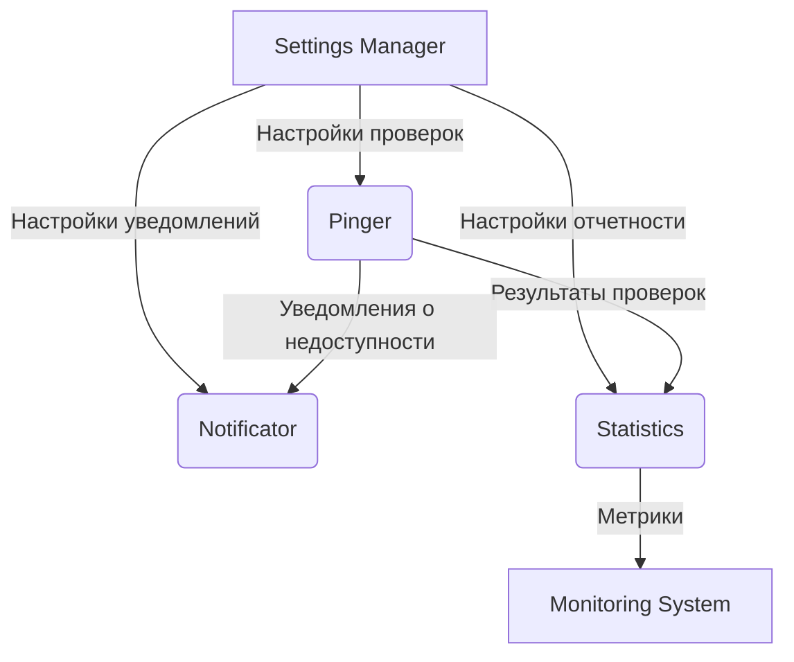

# Архитектура модуля Settings Manager системы мониторинга PingTower

## 1. Введение

Модуль Settings Manager является центральным компонентом системы мониторинга PingTower, отвечающим за управление настройками всех модулей системы. Он обеспечивает централизованное хранение, управление и распространение конфигураций между различными компонентами системы через Apache Kafka.

## 2. Общая архитектура

### 2.1. Технологический стек

- **Язык программирования**: Java
- **Фреймворк**: Spring Boot
- **Система обмена сообщениями**: Apache Kafka
- **Система сборки**: Gradle
- **База данных**: PostgreSQL
- **Кэширование**: Redis
- **Аутентификация и авторизация**: Keycloak, Spring Security

### 2.2. Схема взаимодействия модулей



## 3. Основные компоненты модуля Settings Manager

### 3.1. Configuration Service

Отвечает за централизованное хранение и управление настройками всех модулей системы. Обеспечивает:

- Хранение конфигураций в PostgreSQL
- Кэширование часто используемых настроек в Redis
- Валидацию конфигураций
- Версионирование настроек

### 3.2. REST API Controller

Предоставляет RESTful API для управления настройками системы. Обеспечивает:

- Создание, чтение, обновление и удаление настроек
- Аутентификацию и авторизацию пользователей через Keycloak
- Валидацию входных данных
- Форматирование ответов в JSON

### 3.3. Kafka Producer Service

Отвечает за отправку обновленных настроек в Kafka топики для других модулей системы. Обеспечивает:

- Сериализацию настроек в формат JSON
- Отправку сообщений в соответствующие Kafka топики
- Обработку ошибок отправки

### 3.4. Kafka Consumer Service

Получает запросы на изменение настроек от других модулей системы. Обеспечивает:

- Десериализацию сообщений из Kafka
- Обработку запросов на изменение настроек
- Валидацию и применение изменений

### 3.5. Security Service

Обеспечивает безопасность работы с настройками. Обеспечивает:

- Аутентификацию пользователей через Keycloak
- Авторизацию по ролям
- Шифрование чувствительных данных
- Аудит изменений настроек

### 3.6. Cache Manager

Управляет кэшированием настроек в Redis. Обеспечивает:

- Быстрый доступ к часто используемым настройкам
- Инвалидацию кэша при обновлении настроек
- Синхронизацию кэша между экземплярами сервиса

## 4. Структура хранения настроек

### 4.1. PostgreSQL

Используется для долговременного хранения всех настроек системы:

#### Основные таблицы

- `settings` - основная таблица настроек
- `setting_versions` - версии настроек
- `users` - пользователи системы
- `roles` - роли пользователей
- `user_roles` - связь пользователей и ролей
- `audit_log` - журнал аудита изменений

#### Таблица settings

```sql
CREATE TABLE settings (
    id UUID PRIMARY KEY,
    module VARCHAR(50) NOT NULL,
    key VARCHAR(255) NOT NULL,
    value TEXT,
    description TEXT,
    created_at TIMESTAMP NOT NULL,
    updated_at TIMESTAMP NOT NULL,
    version INTEGER NOT NULL
);
```

### 4.2. Redis

Используется для кэширования часто запрашиваемых настроек:

#### Структура ключей

- `settings:{module}:{key}` - кэш отдельных настроек
- `settings:{module}:*` - кэш всех настроек модуля
- `settings:recent:*` - кэш недавно запрошенных настроек

## 5. REST API для управления настройками

### 5.1. Эндпоинты

#### Получение настроек

- `GET /api/v1/settings` - получить все настройки
- `GET /api/v1/settings/{module}` - получить настройки модуля
- `GET /api/v1/settings/{module}/{key}` - получить конкретную настройку

#### Создание/обновление настроек

- `POST /api/v1/settings` - создать новую настройку
- `PUT /api/v1/settings/{module}/{key}` - обновить настройку
- `PATCH /api/v1/settings/{module}/{key}` - частично обновить настройку

#### Удаление настроек

- `DELETE /api/v1/settings/{module}/{key}` - удалить настройку

#### Управление пользователями

- `GET /api/v1/users` - получить список пользователей
- `POST /api/v1/users` - создать нового пользователя
- `PUT /api/v1/users/{id}` - обновить пользователя
- `DELETE /api/v1/users/{id}` - удалить пользователя

#### Управление ролями

- `GET /api/v1/roles` - получить список ролей
- `POST /api/v1/roles` - создать новую роль
- `PUT /api/v1/roles/{id}` - обновить роль
- `DELETE /api/v1/roles/{id}` - удалить роль

### 5.2. Форматы данных

#### Настройка

```json
{
 "id": "uuid",
  "module": "string",
  "key": "string",
  "value": "string|object",
  "description": "string",
  "createdAt": "ISO8601 datetime",
  "updatedAt": "ISO8601 datetime",
  "version": "integer"
}
```

#### Пользователь

```json
{
  "id": "uuid",
  "username": "string",
  "email": "string",
  "firstName": "string",
  "lastName": "string",
  "createdAt": "ISO8601 datetime",
  "updatedAt": "ISO8601 datetime"
}
```

#### Роль

```json
{
  "id": "uuid",
  "name": "string",
  "description": "string",
  "permissions": ["string"],
  "createdAt": "ISO8601 datetime",
  "updatedAt": "ISO8601 datetime"
}
```

## 6. Формат данных для передачи через Kafka

### 6.1. Топики Kafka

- `pingtower.settings.updates` - обновления настроек
- `pingtower.settings.requests` - запросы на изменение настроек

### 6.2. Формат сообщений

#### Обновление настроек (settings.updates)

```json
{
  "settingId": "uuid",
  "module": "string",
  "key": "string",
  "value": "string|object",
  "timestamp": "ISO8601 datetime",
  "version": "integer",
  "action": "CREATE|UPDATE|DELETE"
}
```

#### Запрос на изменение настроек (settings.requests)

```json
{
  "requestId": "uuid",
  "moduleId": "string",
  "settingKey": "string",
  "newValue": "string|object",
  "requestedBy": "string",
  "timestamp": "ISO8601 datetime",
  "reason": "string"
}
```

## 7. Механизм синхронизации настроек между модулями

### 7.1. Распространение изменений

1. Пользователь изменяет настройки через REST API
2. Configuration Service сохраняет изменения в PostgreSQL
3. Cache Manager обновляет кэш в Redis
4. Kafka Producer Service отправляет сообщение об изменении в Kafka топик
5. Другие модули получают уведомление через Kafka Consumer и обновляют свои локальные кэши

### 7.2. Обработка конфликтов

- Версионирование настроек для предотвращения конфликтов при одновременных изменениях
- Возможность отката к предыдущим версиям настроек
- Логирование всех изменений для аудита

### 7.3. Резервное копирование и восстановление

- Регулярное резервное копирование настроек из PostgreSQL
- Возможность восстановления настроек из резервной копии
- Экспорт/импорт настроек в формате JSON

## 8. Безопасность и аутентификация

### 8.1. Аутентификация пользователей

- Keycloak для аутентификации и управления пользователями
- JWT токены для сессий
- Поддержка различных провайдеров аутентификации через Keycloak

### 8.2. Авторизация

- Ролевая система доступа (RBAC) через Keycloak
- Разграничение доступа к настройкам по модулям
- Возможность создания пользовательских ролей с заданными правами

### 8.3. Шифрование данных

- Шифрование чувствительных настроек (пароли, токены и т.д.)
- Шифрование данных при передаче (TLS/HTTPS)

### 8.4. Аудит

- Логирование всех операций с настройками
- Отслеживание пользователей, выполнивших изменения
- Хранение истории изменений настроек

## 9. Масштабируемость и высокая доступность

### 9.1. Горизонтальное масштабирование

- Возможность запуска нескольких экземпляров сервиса
- Использование Redis Cluster для масштабирования кэша
- Балансировка нагрузки между экземплярами

### 9.2. Высокая доступность

- Репликация базы данных PostgreSQL
- Кластер Redis для отказоустойчивости кэша
- Мониторинг состояния сервиса и автоматический перезапуск при сбоях

### 9.3. Производительность

- Кэширование часто используемых настроек в Redis
- Оптимизация запросов к базе данных
- Асинхронная обработка запросов на изменение настроек

### 9.4. Мониторинг

- Сбор метрик производительности
- Логирование ошибок и предупреждений

## 10. Заключение

Модуль Settings Manager спроектирован как центральный компонент управления конфигурациями в системе мониторинга PingTower. Его архитектура обеспечивает надежное хранение, безопасное управление и эффективное распространение настроек между всеми модулями системы. Использование современных технологий, таких как Spring Boot, PostgreSQL, Redis и Apache Kafka, позволяет обеспечить высокую производительность, масштабируемость и отказоустойчивость модуля.
