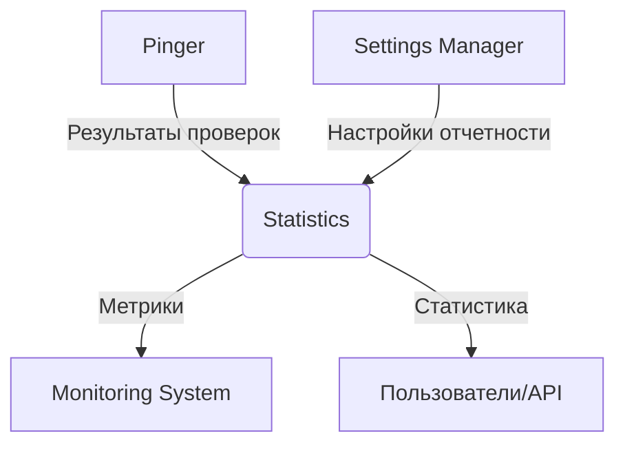

# Архитектура модуля Statistics системы мониторинга PingTower

## 1. Введение

Модуль Statistics является ключевым компонентом системы мониторинга PingTower, отвечающим за сбор, хранение, обработку и предоставление статистики и аналитики по результатам проверок доступности ресурсов. Модуль получает данные от других компонентов системы (в частности, от модуля Pinger) через Apache Kafka, сохраняет их в высокопроизводительные системы хранения данных (PostgreSQL для структурированных данных и Apache Cassandra для аналитики временных рядов), обеспечивает быстрое выполнение запросов и эффективное хранение больших объемов исторических данных.

## 2. Технологический стек

- **Язык программирования**: Java
- **Фреймворк**: Spring Boot
- **Система обмена сообщениями**: Apache Kafka
- **Система сборки**: Gradle
- **База данных**: PostgreSQL
- **База данных для аналитики временных рядов**: Apache Cassandra
- **Кэширование**: Redis
- **Аутентификация и авторизация**: OAuth2, Spring Security
- **Документирование API**: SpringDoc OpenAPI

## 3. Схема взаимодействия модулей



## 4. Основные компоненты модуля

### 4.1. Kafka Consumer

Отвечает за получение сообщений из Kafka топика `pingtower.check.results`. Десериализует сообщения в объекты результатов проверок и передает их Data Processing Service.

### 4.2. Data Processing Service

Основной сервис обработки данных. Получает результаты проверок от Kafka Consumer, выполняет предварительную обработку данных, агрегацию и передает их Data Storage Service.

### 4.3. Data Storage Service

Управляет хранением данных в различных системах хранения:

- **PostgreSQL Storage Service** - для структурированных данных
- **Cassandra Storage Service** - для аналитики временных рядов
- **Redis Cache Service** - для кэширования часто запрашиваемых данных

### 4.4. Data Retrieval Service

Обеспечивает доступ к данным для внешних запросов. Выполняет запросы к различным системам хранения, объединяет данные и передает их API Layer.

### 4.5. API Layer

Предоставляет RESTful API для доступа к статистике и аналитике. Обеспечивает:

- Аутентификацию и авторизацию пользователей
- Валидацию входных данных
- Форматирование ответов в JSON
- Обработку ошибок

### 4.6. Configuration Service

Управляет настройками модуля. Получает настройки из внешних источников (Settings Manager через Kafka или локальные конфигурации). Предоставляет настройки другим сервисам.

### 4.7. Security Service

Обеспечивает безопасность работы с данными статистики. Управляет аутентификацией и авторизацией пользователей, шифрованием чувствительных данных.

### 4.8. Aggregation Service

Отвечает за агрегацию данных для различных временных интервалов (минутные, часовые, дневные и т.д.). Создает агрегированные метрики для более эффективного хранения и быстрого доступа к историческим данным.

## 5. Формат данных для получения результатов проверок через Kafka

Модуль получает результаты проверок из топика `pingtower.check.results` в следующем формате:

```json
{
  "checkId": "string",
  "resourceUrl": "string",
  "timestamp": "ISO8601 datetime",
  "status": "UP|DOWN|UNKNOWN",
  "responseTime": "number (ms)",
  "httpStatusCode": "number (optional)",
  "errorMessage": "string (optional)",
  "metrics": {
    "connectionTime": "number (ms)",
    "timeToFirstByte": "number (ms)",
    "sslValid": "boolean (optional)",
    "sslExpirationDate": "ISO8601 datetime (optional)"
  }
}
```

## 6. Структура хранения данных

### 6.1. PostgreSQL

Используется для хранения структурированных данных, таких как:

- Конфигурации модуля
- Метаданные о проверках
- Информация о пользователях и ролях
- Настройки агрегации
- Справочные данные

#### Основные таблицы

- `check_configs` - конфигурации проверок
- `aggregation_rules` - правила агрегации данных
- `users` - пользователи системы
- `roles` - роли пользователей
- `user_roles` - связь пользователей и ролей

#### Таблица check_configs

```sql
CREATE TABLE check_configs (
    id UUID PRIMARY KEY,
    check_id VARCHAR(50) NOT NULL,
    resource_url VARCHAR(255) NOT NULL,
    check_type VARCHAR(20) NOT NULL,
    frequency INTEGER NOT NULL,
    created_at TIMESTAMP NOT NULL,
    updated_at TIMESTAMP NOT NULL
);
```

#### Таблица aggregation_rules

```sql
CREATE TABLE aggregation_rules (
    id UUID PRIMARY KEY,
    check_id VARCHAR(50) NOT NULL,
    aggregation_interval VARCHAR(20) NOT NULL, -- MINUTE, HOUR, DAY, WEEK, MONTH
    retention_period INTEGER NOT NULL, -- в днях
    created_at TIMESTAMP NOT NULL,
    updated_at TIMESTAMP NOT NULL
);
```

### 6.2. Apache Cassandra

Используется для хранения аналитики временных рядов - результатов проверок. Благодаря своей архитектуре Cassandra идеально подходит для хранения больших объемов временных данных с высокой скоростью записи.

#### Пространства ключей (keyspaces)

- `pingtower_statistics` - основное пространство ключей для хранения статистики

#### Таблицы

- `raw_check_results` - сырые результаты проверок
- `aggregated_check_results` - агрегированные результаты проверок

#### Таблица raw_check_results

```cql
CREATE TABLE raw_check_results (
    check_id VARCHAR,
    timestamp TIMESTAMP,
    status VARCHAR,
    response_time INTEGER,
    http_status_code INTEGER,
    error_message VARCHAR,
    metrics MAP<TEXT, TEXT>,
    PRIMARY KEY (check_id, timestamp)
) WITH CLUSTERING ORDER BY (timestamp DESC);
```

#### Таблица aggregated_check_results

```cql
CREATE TABLE aggregated_check_results (
    check_id VARCHAR,
    aggregation_interval VARCHAR, -- MINUTE, HOUR, DAY, WEEK, MONTH
    timestamp TIMESTAMP,
    up_count INTEGER,
    down_count INTEGER,
    unknown_count INTEGER,
    avg_response_time DOUBLE,
    min_response_time INTEGER,
    max_response_time INTEGER,
    PRIMARY KEY ((check_id, aggregation_interval), timestamp)
) WITH CLUSTERING ORDER BY (timestamp DESC);
```

### 6.3. Redis

Используется для кэширования часто запрашиваемых данных и промежуточных результатов агрегации.

#### Структура ключей

- `stats:check:{checkId}:latest` - последние результаты проверки
- `stats:check:{checkId}:aggregated:{interval}:{timestamp}` - агрегированные данные по интервалам
- `stats:dashboard:*` - данные для дашбордов

## 7. Механизм приема и обработки данных через Kafka

### 7.1. Топики Kafka

- `pingtower.check.results` - основной топик для результатов проверок от модуля Pinger
- `pingtower.statistics.aggregated` - топик для агрегированных данных, которые могут использоваться другими системами

### 7.2. Получение данных

1. Kafka Consumer получает сообщение из топика `pingtower.check.results`
2. Сообщение десериализуется в объект CheckResult
3. CheckResult передается Data Processing Service

### 7.3. Обработка данных

1. Data Processing Service выполняет валидацию полученных данных
2. При необходимости выполняется предварительная обработка данных (нормализация, очистка)
3. Данные передаются Aggregation Service для агрегации
4. Aggregation Service обновляет промежуточные агрегированные данные в Redis
5. Данные передаются Data Storage Service для сохранения

### 7.4. Сохранение данных

1. Data Storage Service сохраняет сырые данные в Cassandra
2. При достижении определенных условий (временные интервалы) Aggregation Service создает агрегированные данные
3. Агрегированные данные сохраняются в Cassandra
4. При необходимости, данные также сохраняются в PostgreSQL для структурированного хранения метаданных

### 7.5. Обработка ошибок

- При возникновении ошибок при обработке сообщений, они помещаются в топик `pingtower.statistics.errors` для дальнейшего анализа
- Реализована система повторной обработки сообщений при временных сбоях
- Ведется логирование всех операций для аудита и отладки

## 8. API для доступа к статистике и аналитике

### 8.1. Общие принципы

API модуля Statistics построен на принципах RESTful архитектуры и предоставляет доступ к статистике и аналитике по результатам проверок. API обеспечивает:

- Аутентификацию и авторизацию пользователей через OAuth2
- Валидацию входных данных
- Форматирование ответов в JSON
- Обработку ошибок с возвратом понятных сообщений
- Документирование через OpenAPI (Swagger)

### 8.2. Базовые эндпоинты

- `GET /api/v1/statistics/checks/{checkId}/latest` - Получение последних результатов проверки
- `GET /api/v1/statistics/checks/{checkId}/history` - Получение истории результатов проверки
- `GET /api/v1/statistics/checks/{checkId}/aggregated` - Получение агрегированных данных по проверке
- `GET /api/v1/statistics/dashboard` - Получение данных для дашборда
- `GET /api/v1/statistics/alerts` - Получение информации о недавних алертах

### 8.3. Параметры запросов

Для фильтрации и сортировки данных API поддерживает следующие параметры:

- `from` и `to` - временные границы для выборки данных (в формате ISO8601)
- `limit` - ограничение на количество возвращаемых записей
- `offset` - смещение для пагинации
- `sort` - параметр сортировки (например, "timestamp:desc")
- `interval` - временной интервал для агрегированных данных (MINUTE, HOUR, DAY, WEEK, MONTH)

### 8.4. Форматы ответов

#### Ответ с последними результатами проверки

```json
{
  "checkId": "string",
  "resourceUrl": "string",
  "timestamp": "ISO8601 datetime",
  "status": "UP|DOWN|UNKNOWN",
  "responseTime": "number (ms)",
  "httpStatusCode": "number (optional)",
  "errorMessage": "string (optional)",
  "metrics": {
    "connectionTime": "number (ms)",
    "timeToFirstByte": "number (ms)",
    "sslValid": "boolean (optional)",
    "sslExpirationDate": "ISO8601 datetime (optional)"
  }
}
```

#### Ответ с агрегированными данными

```json
{
  "checkId": "string",
  "interval": "MINUTE|HOUR|DAY|WEEK|MONTH",
  "from": "ISO8601 datetime",
  "to": "ISO8601 datetime",
  "upCount": "number",
  "downCount": "number",
  "unknownCount": "number",
  "avgResponseTime": "number (ms)",
  "minResponseTime": "number (ms)",
  "maxResponseTime": "number (ms)",
  "uptimePercentage": "number (0-100)"
}
```

#### Ответ с данными для дашборда

```json
{
  "totalChecks": "number",
  "upChecks": "number",
  "downChecks": "number",
  "unknownChecks": "number",
  "overallUptime": "number (0-100)",
  "recentAlerts": [
    {
      "checkId": "string",
      "resourceUrl": "string",
      "timestamp": "ISO8601 datetime",
      "status": "DOWN",
      "downtimeDuration": "number (ms)",
      "errorMessage": "string"
    }
  ]
}
```

### 8.5. Обработка ошибок

API возвращает стандартные HTTP коды ошибок:

- 400 Bad Request - Некорректный запрос
- 401 Unauthorized - Необходима аутентификация
- 403 Forbidden - Недостаточно прав для доступа к ресурсу
- 404 Not Found - Ресурс не найден
- 500 Internal Server Error - Внутренняя ошибка сервера

В теле ответа при ошибке возвращается JSON с описанием ошибки:

```json
{
  "timestamp": "ISO8601 datetime",
  "status": "number",
  "error": "string",
  "message": "string",
  "path": "string"
}
```

## 9. Обеспечение быстрого выполнения запросов и эффективного хранения больших объемов исторических данных

### 9.1. Оптимизация запросов

Для обеспечения быстрого выполнения запросов применяются следующие подходы:

1. **Индексация в Cassandra**:
   - Создание вторичных индексов для часто используемых полей (например, `status`, `http_status_code`)
   - Использование материализованных представлений для сложных запросов
   - Оптимизация схемы таблиц для минимизации количества обращений к дискам

2. **Кэширование в Redis**:
   - Хранение часто запрашиваемых данных в памяти
   - Использование структур данных Redis (хэши, списки, множества) для оптимизации доступа
   - Реализация стратегий инвалидации кэша при обновлении данных

3. **Пагинация и ограничение результатов**:
   - Ограничение количества возвращаемых записей по умолчанию
   - Реализация курсорной пагинации для больших наборов данных
   - Позволение клиентам указывать желаемое количество записей

4. **Предагрегация данных**:
   - Создание агрегированных данных с различными интервалами (минутные, часовые, дневные и т.д.)
   - Хранение предагрегированных данных в отдельных таблицах для быстрого доступа
   - Обновление агрегированных данных в фоновом режиме

### 9.2. Эффективное хранение больших объемов исторических данных

1. **Партиционирование в Cassandra**:
   - Использование временного партиционирования для таблиц с временными рядами
   - Автоматическое создание новых партиций по мере поступления данных
   - Удаление старых партиций в соответствии с политикой хранения

2. **Политики хранения**:
   - Настройка времени жизни (TTL) для записей в Cassandra
   - Реализация механизма архивирования старых данных в более дешевые хранилища
   - Возможность настройки различных политик хранения для разных типов данных

3. **Сжатие данных**:
   - Использование алгоритмов сжатия на уровне хранилища
   - Реализация пользовательских алгоритмов сжатия для специфических типов данных
   - Баланс между степенью сжатия и производительностью

4. **Оптимизация структуры данных**:
   - Использование компактных форматов хранения данных
   - Минимизация количества дублирующихся данных
   - Применение нормализации и денормализации в зависимости от сценариев использования

## 10. Механизмы агрегации данных

### 10.1. Общие принципы агрегации

Агрегация данных в модуле Statistics выполняется для оптимизации хранения и ускорения доступа к историческим данным. Агрегация выполняется по следующим временным интервалам:

- Минутные агрегаты
- Часовые агрегаты
- Дневные агрегаты
- Недельные агрегаты
- Месячные агрегаты

### 10.2. Процесс агрегации

1. **Получение сырых данных**:
   - Aggregation Service получает сырые данные от Data Processing Service
   - Данные временно сохраняются в Redis для быстрого доступа

2. **Накопление данных**:
   - В Redis накапливаются промежуточные агрегированные данные для текущего временного интервала
   - При получении новых данных выполняется обновление накопленных значений

3. **Создание агрегатов**:
   - По истечении временного интервала Aggregation Service создает агрегированные данные
   - Выполняются расчеты метрик (среднее, минимальное, максимальное время отклика, количество успешных/неуспешных проверок и т.д.)

4. **Сохранение агрегатов**:
   - Агрегированные данные сохраняются в Cassandra в таблице `aggregated_check_results`
   - При необходимости, данные также сохраняются в PostgreSQL для структурированного хранения метаданных

### 10.3. Алгоритмы агрегации

1. **Агрегация статусов**:
   - Подсчет количества проверок с каждым статусом (UP, DOWN, UNKNOWN)
   - Расчет процента доступности (uptime)

2. **Агрегация времени отклика**:
   - Расчет среднего, минимального и максимального времени отклика
   - Расчет процентилей (95, 99) времени отклика

3. **Агрегация HTTP кодов**:
   - Подсчет частоты различных HTTP кодов ответа

4. **Агрегация ошибок**:
   - Группировка и подсчет типов ошибок

### 10.4. Настройка агрегации

Настройки агрегации хранятся в PostgreSQL в таблице `aggregation_rules` и могут включать:

- Интервалы агрегации для каждого типа проверки
- Период хранения агрегированных данных
- Параметры расчета метрик

Настройки могут быть изменены через Settings Manager, который отправляет обновления в Statistics модуль через Kafka.

## 11. Безопасность и аутентификация

### 11.1. Аутентификация пользователей

Модуль Statistics использует OAuth2 для аутентификации пользователей. Поддерживаются следующие провайдеры аутентификации:

- Keycloak (основной провайдер)
- Другие OAuth2-совместимые провайдеры

Аутентификация выполняется на уровне API Gateway или непосредственно в модуле Statistics через Spring Security.

### 11.2. Авторизация

Авторизация осуществляется на основе ролей пользователей. Поддерживаются следующие роли:

- `STATISTICS_VIEWER` - доступ только для чтения статистики
- `STATISTICS_EDITOR` - возможность изменения настроек статистики
- `STATISTICS_ADMIN` - полный доступ ко всем функциям модуля

Роли пользователей хранятся в PostgreSQL и кэшируются в Redis для быстрого доступа.

### 11.3. Защита данных

1. **Шифрование данных в transit**:
   - Все коммуникации между компонентами системы защищены с помощью TLS/HTTPS
   - Kafka топики защищены с помощью SSL/TLS

2. **Шифрование данных at rest**:
   - Чувствительные данные (например, токены доступа к внешним системам) шифруются перед сохранением в базу данных
   - Используется AES-256 для шифрования данных

3. **Управление секретами**:
   - Секреты (ключи шифрования, пароли и т.д.) хранятся во внешнем хранилище секретов (например, HashiCorp Vault)
   - Модуль Statistics получает секреты через безопасный канал при запуске

### 11.4. Аудит и логирование

1. **Аудит действий пользователей**:
   - Все операции с данными статистики логируются с указанием пользователя, времени и типа операции
   - Логи аудита хранятся в отдельной таблице PostgreSQL

2. **Логирование безопасности**:
   - Попытки несанкционированного доступа логируются и передаются в систему мониторинга
   - Подозрительные действия анализируются системой SIEM

### 11.5. Rate Limiting

Для предотвращения DoS-атак и обеспечения стабильной работы системы реализованы механизмы ограничения количества запросов:

- Ограничение по IP-адресу
- Ограничение по пользователю
- Ограничение по типу запроса

## 12. Масштабирование и высокая доступность

### 12.1. Горизонтальное масштабирование

Модуль Statistics спроектирован с учетом возможности горизонтального масштабирования:

1. **Масштабирование сервисов**:
   - Все сервисы модуля (Data Processing, Aggregation, API и др.) могут быть запущены в нескольких экземплярах
   - Используется балансировка нагрузки для распределения запросов между экземплярами

2. **Масштабирование баз данных**:
   - PostgreSQL может быть развернут в конфигурации master-slave для масштабирования чтения
   - Cassandra изначально спроектирована для горизонтального масштабирования с помощью добавления новых узлов в кластер
   - Redis может быть развернут в конфигурации кластера для масштабирования

### 12.2. Высокая доступность

1. **Отказоустойчивость сервисов**:
   - Использование механизмов отказоустойчивости Spring Boot
   - Реализация паттернов Circuit Breaker и Retry для внешних зависимостей
   - Мониторинг состояния сервисов и автоматический перезапуск при сбоях

2. **Отказоустойчивость баз данных**:
   - Репликация данных в PostgreSQL для обеспечения отказоустойчивости
   - Кластер Cassandra с репликацией данных между узлами
   - Кластер Redis для отказоустойчивости кэша

3. **Отказоустойчивость очередей сообщений**:
   - Kafka развернут в конфигурации кластера с репликацией топиков
   - Использование механизмов подтверждения получения сообщений

### 12.3. Балансировка нагрузки

1. **Балансировка между экземплярами сервисов**:
   - Использование внешнего балансировщика нагрузки (Traefik)
   - Kubernetes Service для внутренней балансировки в контейнеризированной среде

2. **Распределение данных**:
   - Cassandra автоматически распределяет данные между узлами кластера
   - Использование consistent hashing для равномерного распределения данных

### 12.4. Мониторинг и самодиагностика

1. **Метрики производительности**:
   - Сбор метрик в Cassandra

2. **Health Checks**:
   - Реализация эндпоинтов для проверки состояния сервисов
   - Проверка доступности баз данных и очередей сообщений

3. **Логирование и трассировка**:
   - Централизованное логирование через Cassandra

## 13. Заключение

Модуль Statistics спроектирован как высокопроизводительный и масштабируемый компонент системы мониторинга PingTower. Его архитектура обеспечивает эффективное хранение и обработку больших объемов данных о результатах проверок доступности ресурсов, а также предоставляет мощные инструменты для аналитики и визуализации.

Основные преимущества архитектуры:

1. **Гибкость хранения данных**:
   - Использование PostgreSQL для структурированных данных обеспечивает надежность и ACID-свойства
   - Использование Cassandra для аналитики временных рядов обеспечивает высокую производительность при работе с большими объемами данных
   - Использование Redis для кэширования обеспечивает быстрый доступ к часто запрашиваемым данным

2. **Масштабируемость и высокая доступность**:
   - Возможность горизонтального масштабирования всех компонентов системы
   - Отказоустойчивость на уровне сервисов, баз данных и очередей сообщений
   - Балансировка нагрузки между экземплярами сервисов

3. **Безопасность**:
   - Комплексная система аутентификации и авторизации
   - Шифрование данных в transit и at rest
   - Аудит действий пользователей и логирование безопасности

4. **Производительность**:
   - Оптимизация запросов через индексацию, кэширование и предагрегацию данных
   - Эффективное хранение больших объемов исторических данных через партиционирование и политики хранения
   - Rate limiting для предотвращения DoS-атак

5. **Интеграция с другими модулями**:
   - Использование Apache Kafka для асинхронного обмена сообщениями с другими модулями системы
   - Получение настроек от Settings Manager через Kafka
   - Передача агрегированных данных другим системам через Kafka

Модуль Statistics готов к интеграции в существующую экосистему PingTower и обеспечит надежную основу для сбора, хранения и анализа статистики мониторинга.
